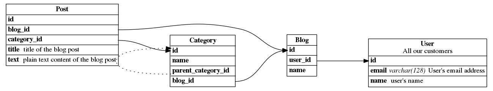

# ERD

The compiler of the *simplest* DSL to draw ER diagrams. This project is still under PoC phase.

## Install

Execute the following command to install the latest version.

    go get github.com/k-kawa/erd

Or [download](https://github.com/k-kawa/erd/releases) the executable binary suitable for your environment

## Usage

You can write the table definitions with your favorite editor like this

    User : All our customers {
      id
      email varchar(128) : User's email address
      name : User's name
    }
    
    Post {
      id
      blog_id -> Blog.id
      category_id -> Category.id
      title : title of the blog post
      text : plain text of the blog post
    }
    
    Blog {
      id
      user_id -> User.id
      name
    }
    
    Category {
      id
      name
      parent_category_id ..> Category.id
      blog_id -> Blog.id
    }

    
and store it to `sample.erd`.
 
Then, you can convert it to the Graphviz Dot format with `erd` command like this.

    $ cat sample.erd | erd
    digraph er {
        ....
    }

Finally you can convert it to a PNG image with `dot` command like this.

    $ cat sample.erd | erd | dot -Tpng -o sample.png

## License
MIT
