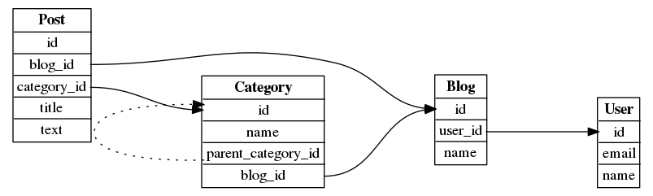

# ERD

The compiler of the *simplest* DSL to draw ER diagrams. This project is still under PoC phase.

## Install

    go get github.com/k-kawa/erd

## Usage

You can write the table definitions with your favorite editor like this

    User {
      id
      email
      name
    }
    
    Post {
      id
      blog_id -> Blog.id
      category_id -> Category.id
      title
      text
    }
    
    Blog {
      id
      user_id -> User.id
      name
    }
    
    Category {
      id
      name
      parent_category_id -> Category.id
      blog_id -> Blog.id
    }

    
and store it to `erd.src`.
 
Then, you can convert it to the Graphviz Dot format with `erd` command like this.

    $ cat erd.src | erd
    digraph er {
            graph [rankdir=LR];
            ranksep="1.2";
            overlap=false;
            splines=true;
            sep="+30,30";
            node [shape=plaintext];
            edge [fontsize=7];
    
    User[label=<
    <TABLE STYLE="RADIAL" BORDER="1" CELLBORDER="0" CELLSPACING="1" ROWS="*">
      <TR><TD><B>User</B></TD></TR>
        <TR><TD PORT="id">id</TD></TR>
        <TR><TD PORT="email">email</TD></TR>
        <TR><TD PORT="name">name</TD></TR>
    </TABLE>
    >];
    
    Post[label=<
    <TABLE STYLE="RADIAL" BORDER="1" CELLBORDER="0" CELLSPACING="1" ROWS="*">
      <TR><TD><B>Post</B></TD></TR>
        <TR><TD PORT="id">id</TD></TR>
        <TR><TD PORT="blog_id">blog_id</TD></TR>
        <TR><TD PORT="category_id">category_id</TD></TR>
        <TR><TD PORT="title">title</TD></TR>
        <TR><TD PORT="text">text</TD></TR>
    </TABLE>
    >];
    
    Blog[label=<
    <TABLE STYLE="RADIAL" BORDER="1" CELLBORDER="0" CELLSPACING="1" ROWS="*">
      <TR><TD><B>Blog</B></TD></TR>
        <TR><TD PORT="id">id</TD></TR>
        <TR><TD PORT="user_id">user_id</TD></TR>
        <TR><TD PORT="name">name</TD></TR>
    </TABLE>
    >];
    
    Category[label=<
    <TABLE STYLE="RADIAL" BORDER="1" CELLBORDER="0" CELLSPACING="1" ROWS="*">
      <TR><TD><B>Category</B></TD></TR>
        <TR><TD PORT="id">id</TD></TR>
        <TR><TD PORT="name">name</TD></TR>
        <TR><TD PORT="parent_category_id">parent_category_id</TD></TR>
        <TR><TD PORT="blog_id">blog_id</TD></TR>
    </TABLE>
    >];

Finally you can convert it to a PNG image with `dot` command like this.

    $ cat erd.src | erd | dot -Tpng -o erd.png

